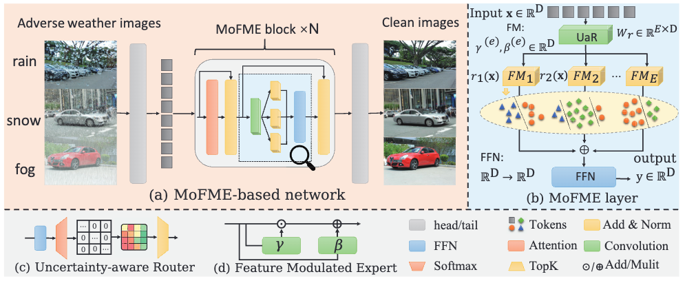

# Efficient Deweather Mixture-of-Experts with Uncertainty-aware Feature-wise Linear Modulation [**[Paper]**](https://ojs.aaai.org/index.php/AAAI/article/download/29622/31055)
Rongyu Zhang, Yulin Luo, Jiaming Liu, Huanrui Yang, Zhen Dong, Denis Gudovskiy, Tomoyuki Okuno, Yohei Nakata, Kurt Keutzer, Yuan Du, Shanghang Zhang



## Installation

1. Clone the repository:
  ```
git clone https://github.com/RoyZry98/MoFME-AAAI2024-Offiicial.git
  ```
2. Install the required packages:
  ```
pip install -r requirements.txt
  ```
## Dataset Preparation

3. Download the Allweather Dataset via Baidu Netdisk:
- Link: [https://pan.baidu.com/s/1hIeYU_OolKKUBx8N2FUlhA?pwd=lgap](https://pan.baidu.com/s/1hIeYU_OolKKUBx8N2FUlhA?pwd=lgap)
- Code: `lgap`

4. Modify the dataset path:
- In `MoWE_DDP/configs/dataset_cfg.py`, replace `'/data/lyl/data/allweather'` on line 39 with your dataset path.

## Training

5. Train the model:
- Navigate to the project directory:
  ```
  cd MoWE_DDP
  ```
- Configure the hyperparameters:
  ```python
  ps=8  # patch size of Transformer backbone
  bs=64  # batch size
  ep=200  # training epoch
  lr=0.0002  # learning rate
  scheduler='cosine+warmup'  # scheduler, optional: []
  task='low_level'   # optional: derain, desnow, deraindrop(allweather)
  dataset='allweather'  # optional: allweather
  model='mowe'       # optional: []
  dim=384  # embedding dimension of Transformer backbone
  interval=20  # Test once per ${interval} epoch
  ```

- Adjust the number of GPUs to be used:
  ```
  export CUDA_VISIBLE_DEVICES='4,5,6,7'
  
  torchrun --master_port 29510 --nproc_per_node=4 train.py \
  
  --gpu-list 4 5 6 7
  ```

- Run baseline and naive MoE:
  ```
  bash scripts_allweather_mofme_baseline.sh
  ```

- Run MoFME:
  ```
  bash scripts_allweather_mofme_ours.sh
  ```

## Testing

6. Test the model:
- After training, use the official Allweather test set.

  `$output_dir`: set as the output dir of the testing metrics 

  `$model_path`: replaced to the path of best_metric.pth
  ```
  output_dir=allweather_moe-film-linear-basenet-star-gelu-n${n}-k${k}_ep200
  model_path=output/train/allweather_moe-film-linear-basenet-star-gelu-n${n}-k${k}_bs64_ep200_ps8_embed384_mlpx4_mlpupsample-outchx4_cnn-embed_wo-pe_normalize_vgg0.04_lr0.0002/best_metric.pth
  ```
- Run the testing script:
  ```
  bash scripts_test.sh
  ```

## Inference

7. Infer all images under a directory:
- Configure the script:

  Change `$model_path`, `$output_dir`, `$task[optional: derain, deraindrop, desnow]`, `$cuda`
  ```
  bash scripts_infer.sh
  ```

8. Infer a single image:
- Configure the script:

  Change `$model_path`, `$output_dir`, `$img_path`, `$task[optional: derain, deraindrop, desnow]`, `$cuda`
  ```
  bash scripts_infer_one.sh
  ```
